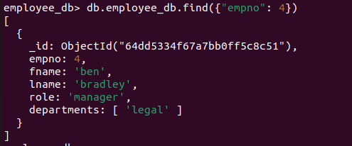

# CRUD Opeartions

## Create Operations

#### Create a new database called employee_db

#### Create a collection called employee_info

#### Insert data into our collection

## Counting Record

#### count distinct values

## Filtering on a single field

## Filtering on multiple fields

## Filtering embedded documents

## Projections

## Update Operations

MongoDB offers multiple operators that can be used in its update operations. In the exercise above, we looked at the `$set` operator. 

|Name|Description|
|---|---|
|`$set`|Sets the value of a field in a document|
|`$unset`|Removes the specified field from a document|
|`$currentDate`|Sets the value of a field to current date, either as a Date or a Timestamp|
|`$inc`|Increments the value of a field by a specified amount|
|`$mul`|Multiplies the value of the field by the specified amount|
|`$min`|Only updates the field if the specified value is less than the existing field value.|
|`$max`|Only updates the field if the specified value is greater than the existing field value.|
|`$setOnInsert`|Sets the value of a field if an update results in an insert of a document. Has no effect on update operations that modify existing documents.|
|`$rename`|Renames a field|

## Delete Operations

