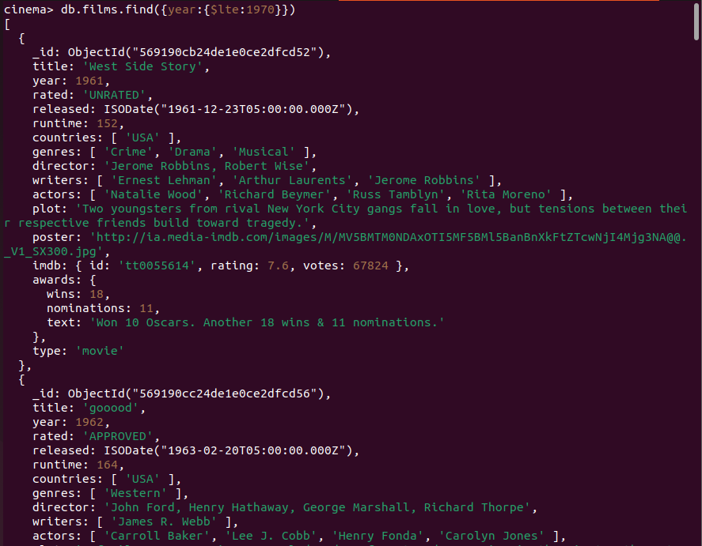
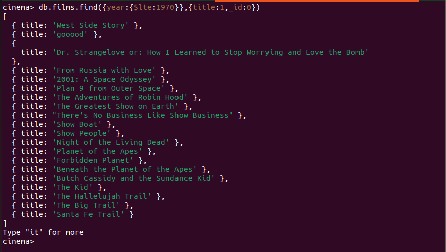
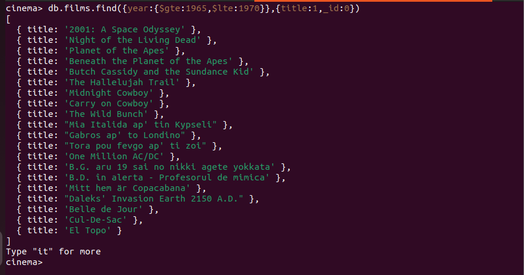
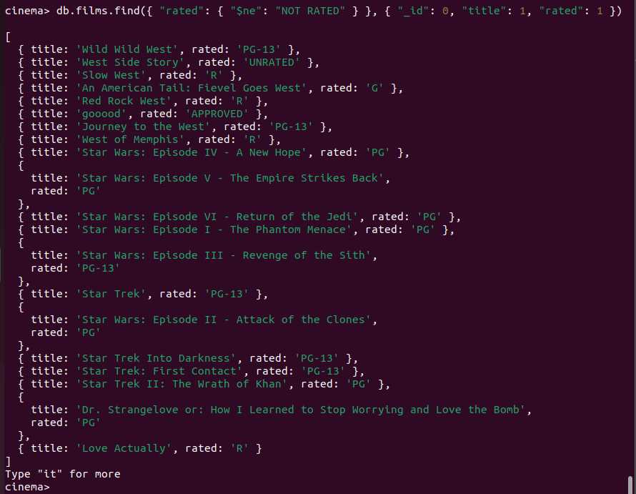
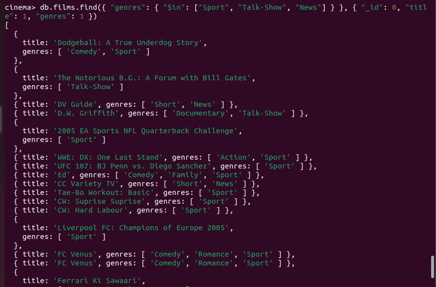
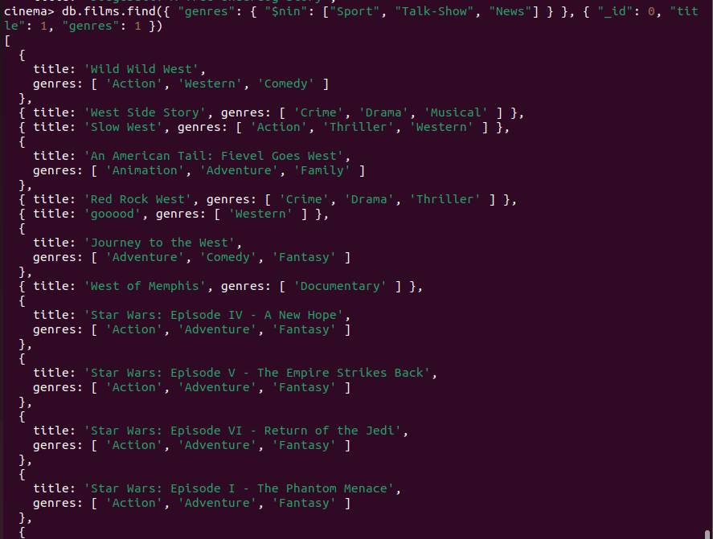
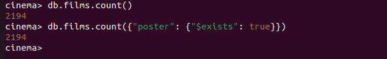
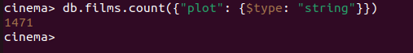
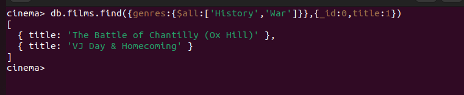
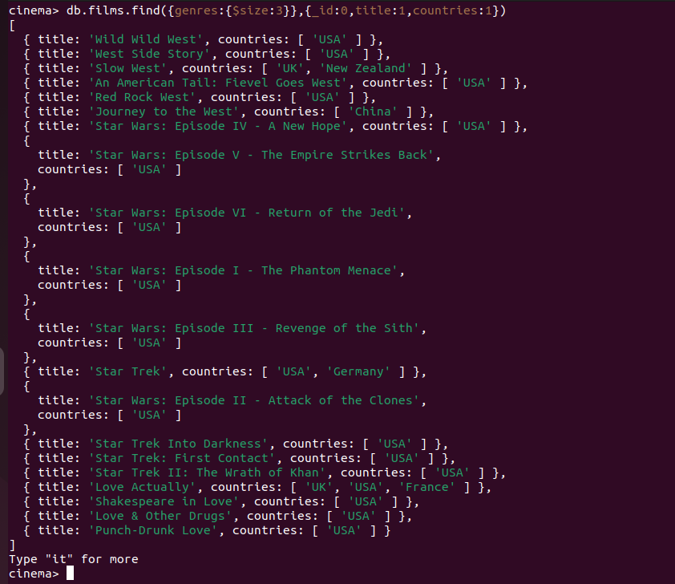

# Intermediate Mongo Queries

### comparaison operators

($eq, $qt, $gte, $in, $lt, $lte, $ne, $nin)

We look at movies which were made in the year 1970 or before

What about movies which were made in or before 1970 but after 1965?

### The $ne query operator

### The "$in" query operator

### the $nin query operator

## Logical Operators

These operators perform one of the following logical operations on the fields:

Name | Description
--- | ---
$and | Joins query clauses with a logical AND returns all documents that match the conditions of both clauses.
$or | Joins query clauses with a logical OR returns all documents that match the conditions of either clause.
$not | Inverts the effect of a query expression and returns documents that do not match the query expression.
$nor | Joins query clauses with a logical NOR returns all documents that fail to match both clauses.

### Element Operators

Name | Description
--- | ---
$exists | Matches documents that have the specified field.
$type | Selects documents if a field is of the specified type.

### Array Operators

Name | Description
--- | ---
$all | Matches arrays that contain all elements specified in the query.
$elemMatch | Selects documents if element in the array field matches all the specified $elemMatch conditions.
$size | Selects documents if the array field is a specified size.

Use the $all operator to find movies which were both: History and War genres.

The $elemMatch query operator in MongoDB is used to query documents that contain arrays and to match documents where at least one array element matches the specified criteria. It's often used to apply complex conditions to array elements within a single document.

### The "$size" query operator

