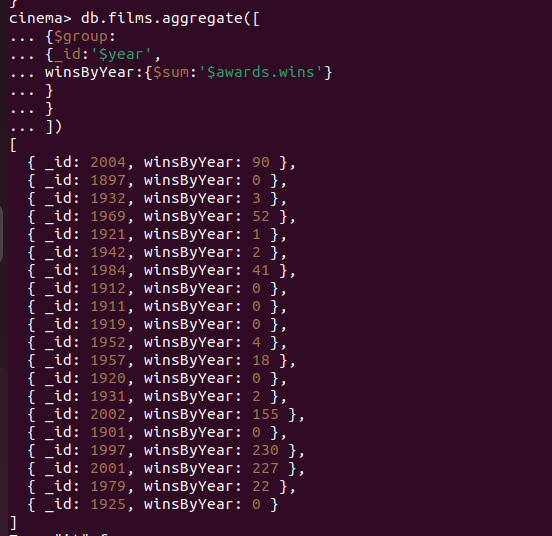
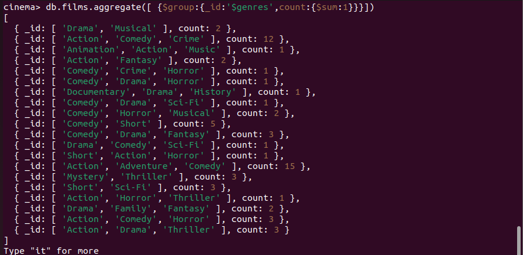
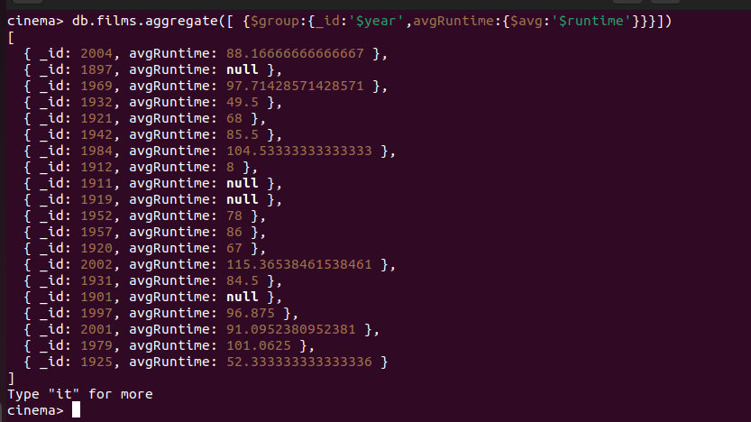
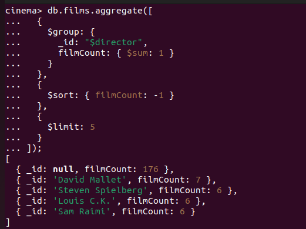

# Advanced Queries

#### Aggregations

db.collection.aggregate([
  { $match: { /* Filtering criteria */ } },
  { $group: { /* Grouping criteria */ } },
  { $project: { /* Projection criteria */ } },
  // ... Additional stages
]);

### The $group operator

Count the number of films by genre:

Find the average runtime of films released in each year:

Find the top 5 directors with the most films

